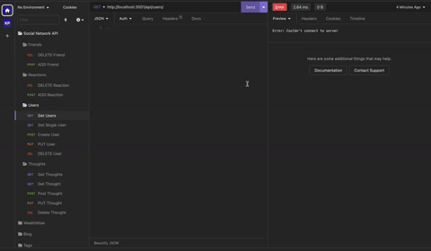
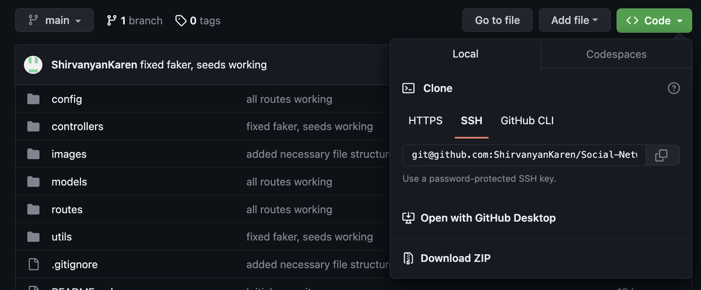
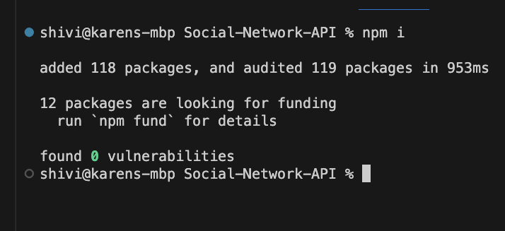
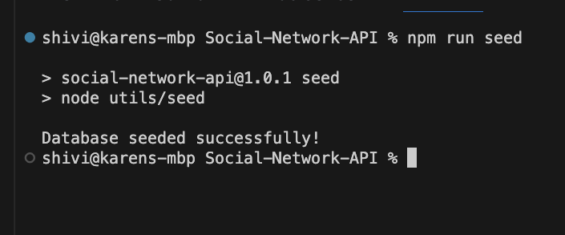
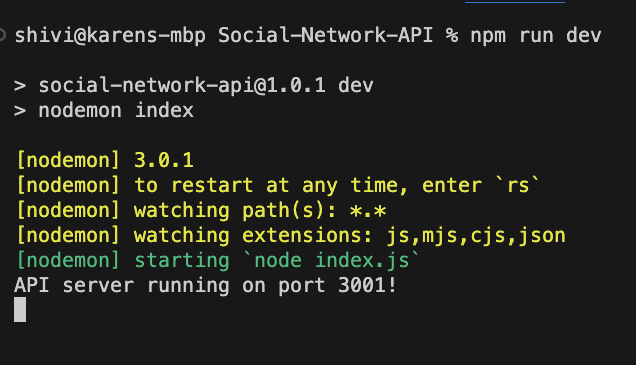
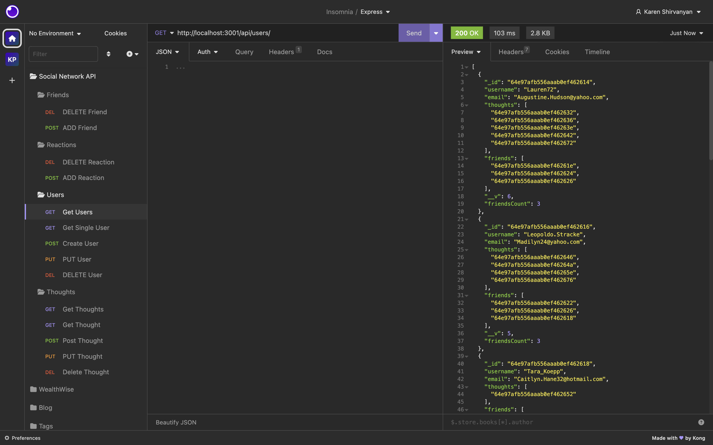

# Social-Network-API

## Technology used
| Technology Used         | Resource URL           | 
| ------------- |:-------------:| 
| Demo Video  | [https://drive.google.com/file/d/1UVTc8BDZzYHfEQGqK8rrWMvmieC51StJ/view](https://drive.google.com/file/d/1UVTc8BDZzYHfEQGqK8rrWMvmieC51StJ/view) |
| My Repository      | [https://github.com/ShirvanyanKaren/Social-Network-API](https://github.com/ShirvanyanKaren/Social-Network-API) |
| MongoDB | [https://www.mongodb.com/docs/](https://www.mongodb.com/docs/) |
| Mongoose  | [https://mongoosejs.com/docs/guide.html](https://mongoosejs.com/docs/guide.html) |
| Express JS | [https://expressjs.com/en/4x/api.html#express.router](https://expressjs.com/en/4x/api.html#express.router) |
| Faker  | [https://fakerjs.dev/api/](https://fakerjs.dev/api/) |
| Dayjs  | [https://day.js.org/docs/en/installation/node-js](https://day.js.org/docs/en/installation/node-js) |
| Git | [https://git-scm.com/](https://git-scm.com/)     | 


# Description

The purpose of this application is to create a social network api with a NoSQL database. The app enables users to be to create accounts and thoughts, update user accounts and thoughts, as well as add and delete friends and reactions to thoughts


The application had to meet the following acceptance criteria:

```md
GIVEN a social network API
WHEN I enter the command to invoke the application
THEN my server is started and the Mongoose models are synced to the MongoDB database
WHEN I open API GET routes in Insomnia for users and thoughts
THEN the data for each of these routes is displayed in a formatted JSON
WHEN I test API POST, PUT, and DELETE routes in Insomnia
THEN I am able to successfully create, update, and delete users and thoughts in my database
WHEN I test API POST and DELETE routes in Insomnia
THEN I am able to successfully create and delete reactions to thoughts and add and remove friends to a user’s friend list
```

Here is an example of how the application runs using insomnia:




## Table of Contents
* [MongoDB Models, Controllers, and Routes](#mongodb-models-controllers-and-routes)
* [Usage and Installation](#usage-and-installation)
* [License](#license)
* [Questions](#questions) 


## MongoDB Models, Controllers, and Routes

The Social Network API utilized the model and controller components of the MVC paradigm by utilizing MongoDB, a NoSQL database program, incorporated in JS through the package mongoose. Express JS as well as well organized routes and controller files complemented the implementation of this database by enabling access to the backend via CRUd operations. 

### MongoDB/ Mongoose Models

The relational models of users and thoughts were utilized and integrated with MongoDb via a connection with the mongoose package. 


```js
// create user schema with specified values
const userSchema = new Schema(
{
   username: {
    type: String,
    required: true,
    unique: true,
    trim: true,
    },
    email: {
    type: String,
    required: [true, 'Email address is a required field'],
    unique: true,
    //include validation using email regex
    validate: {
        validator: function (v) {
            return /^([a-zA-Z0-9_\.-]+)@([a-zA-Z\d\.-]+)\.([a-zA-Z\.]{2,6})$/
            .test(v);
        },
        message: props => `${props.value} is not a valid email address`
    },
    },
    thoughts: [
        {
            type: Schema.Types.ObjectId,
            ref: 'Thought',
        }
    ],
    friends: [
        {
            type: Schema.Types.ObjectId,
            ref: 'User',
    },
],
},
{
    toJSON: {
        virtuals: true,
        getters: true
    },
    id: false,
}
);
//create virtual to calculate amount of friends per user
userSchema.virtual('friendsCount').get(function (){
    return this.friends.length;
})
```
Mongoose allows for the utilization of virtuals that allow properties, such as 'friendcount', to be present within querries but not persist within the database. 

```js
const thoughtSchema = new Schema(
{
    thoughtText: {
        type: String,
        required: true,
        minlength: 1,
        maxlength: 280,
    },
    createdAt: {
        type: Date,
        default: Date.now,
        get: dateVal => dayjs(dateVal).format(`MMMM D, YYYY [at] h:mm A`)
    },
    username: {
        type: String,
        required: true,
    },
    // include reactionschema as an array part of the thoughtschema
    reactions: [reactionSchema],

},
{
    toJSON: {
        getters: true,
        virtuals: true,
    },
    id: false,
}
);
```


Mongoose also allows seemless integration of seperate MongoDB schemas into one model. In this instance, the reactionSchema is included as a part of the thoughtSchema model, creating a referential relationship between the two where reactions belong to a given thought.


### Controllers

The use of controllers in this assignment were integrated differently from the familiar MVC paradigm of having controllers and routes be synonymous. Instead for this assignment I opted to seperate the controllers and routes and instead export asynchronous functions that would later be used within seperate routing directory.

```js
// export all controllers to be utilized in routes
module.exports = {
    async getThoughts(req, res) {
        try {
            const thoughts = await Thought.find();
            res.json(thoughts);
        } catch (err) {
            res.status(500).json(err);
        }
    },

    async getSingleThought(req, res) {
        try {
            const thought = await Thought.findOne({ _id: req.params.thoughtId })
            .select('-__v')
            .populate('reactions');
            if(!thought){
                return res.status(404).json({ message: 'No thought with that id!'});
            }
            res.json(thought);
        } catch (err) {
            res.status(500).json(err);
        }
    },
    async createThought(req, res) {
        try {
            const createThought = await Thought.create(req.body);
            const userThought = await User.findOneAndUpdate(
                { _id: req.body.userId },
                { $addToSet: { thoughts: createThought._id }},
                { runValidators: true, new: true }
            );
                res.json(createThought);
        } catch (err) {
            res.status(500).json(err);
        }
    },
    
```

These follow a similar structure to the express routing functions I was used to in previous projects, but instead of defining the endpoints within the functions via Express routing, we opt for only including the necessary CRUD operations.

### Routing

This design essentially made the routing directory a lot simpler. Instead of defining the api endpoints in one directory, we seperate our routes and controllers. 

```js
//gather all functions for thoughts
const {
    getThoughts,
    getSingleThought,
    createThought,
    updateThought,
    deleteThought,
    addReaction,
    deleteReaction
} = require('../../controllers/thoughtController')


//assign these functions RESTful routes
router.route('/').get(getThoughts).post(createThought)

router.route('/:thoughtId').get(getSingleThought).delete(deleteThought).put(updateThought);

router.route('/:thoughtId/reactions').post(addReaction);

router.route('/:thoughtId/reactions/:reactionId').delete(deleteReaction);
```

Essentially, we define the CRUD operations within the controllers directory and assign the routes using Express JS in a seperate routes directory. This opts for more files and folders, but makes the backend more organized and modularized


## Usage and Installation

This application can be used as a backend template for a Social Network Application where users can add friends and their own thoughts/ reactions as well as update them. 

To install simply clone or fork the repository:



After cloning down the repo, make sure to run npm install to install the necessary dependencies. To seed the database, input 'npm run seed' in the terminal that will input placeholder data using Faker JS. 






Enter 'npm run dev' or 'npm start' to establish the server connection with the database.




Finally, you can open an API application such as postman or insomnia and access the database with the given endpoints



## License 
     
MIT licensing with permisions such as commercial use, modification, distribution and private use. Limitations include liability and warranty.

## Questions 

* Check out my other projects on my [my Github](https://github.com/ShirvanyanKaren)
* For any additional questions or concerns, please email me at kshirvanyan2000@gmail.com